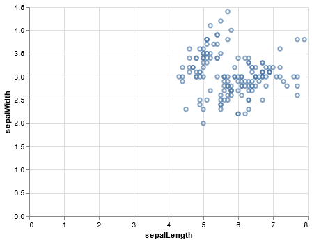

```python
import altair as alt
from vega_datasets import data

alt.renderers.enable("mimetype");
```


```python
df = data.iris()
alt.Chart(df).encode(x="sepalLength", y="sepalWidth").mark_point().interactive()
```


    

    


```python

```
