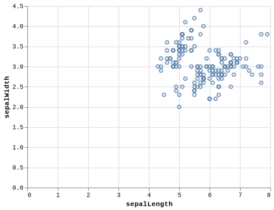

```python
from google.colab import drive
drive.mount('/content/drive')
```

    Mounted at /content/drive


```python
!pip install altair_saver
```

    Looking in indexes: https://pypi.org/simple, https://us-python.pkg.dev/colab-wheels/public/simple/
    Requirement already satisfied: altair_saver in /usr/local/lib/python3.7/dist-packages (0.5.0)
    Requirement already satisfied: altair-data-server>=0.4.0 in /usr/local/lib/python3.7/dist-packages (from altair_saver) (0.4.1)
    Requirement already satisfied: altair-viewer in /usr/local/lib/python3.7/dist-packages (from altair_saver) (0.4.0)
    Requirement already satisfied: altair in /usr/local/lib/python3.7/dist-packages (from altair_saver) (4.2.0)
    Requirement already satisfied: selenium in /usr/local/lib/python3.7/dist-packages (from altair_saver) (4.2.0)
    Requirement already satisfied: tornado in /usr/local/lib/python3.7/dist-packages (from altair-data-server>=0.4.0->altair_saver) (5.1.1)
    Requirement already satisfied: portpicker in /usr/local/lib/python3.7/dist-packages (from altair-data-server>=0.4.0->altair_saver) (1.3.9)
    Requirement already satisfied: pandas>=0.18 in /usr/local/lib/python3.7/dist-packages (from altair->altair_saver) (1.3.5)
    Requirement already satisfied: toolz in /usr/local/lib/python3.7/dist-packages (from altair->altair_saver) (0.11.2)
    Requirement already satisfied: entrypoints in /usr/local/lib/python3.7/dist-packages (from altair->altair_saver) (0.4)
    Requirement already satisfied: jsonschema>=3.0 in /usr/local/lib/python3.7/dist-packages (from altair->altair_saver) (4.3.3)
    Requirement already satisfied: numpy in /usr/local/lib/python3.7/dist-packages (from altair->altair_saver) (1.21.6)
    Requirement already satisfied: jinja2 in /usr/local/lib/python3.7/dist-packages (from altair->altair_saver) (2.11.3)
    Requirement already satisfied: pyrsistent!=0.17.0,!=0.17.1,!=0.17.2,>=0.14.0 in /usr/local/lib/python3.7/dist-packages (from jsonschema>=3.0->altair->altair_saver) (0.18.1)
    Requirement already satisfied: attrs>=17.4.0 in /usr/local/lib/python3.7/dist-packages (from jsonschema>=3.0->altair->altair_saver) (21.4.0)
    Requirement already satisfied: importlib-resources>=1.4.0 in /usr/local/lib/python3.7/dist-packages (from jsonschema>=3.0->altair->altair_saver) (5.7.1)
    Requirement already satisfied: importlib-metadata in /usr/local/lib/python3.7/dist-packages (from jsonschema>=3.0->altair->altair_saver) (4.11.3)
    Requirement already satisfied: typing-extensions in /usr/local/lib/python3.7/dist-packages (from jsonschema>=3.0->altair->altair_saver) (4.2.0)
    Requirement already satisfied: zipp>=3.1.0 in /usr/local/lib/python3.7/dist-packages (from importlib-resources>=1.4.0->jsonschema>=3.0->altair->altair_saver) (3.8.0)
    Requirement already satisfied: python-dateutil>=2.7.3 in /usr/local/lib/python3.7/dist-packages (from pandas>=0.18->altair->altair_saver) (2.8.2)
    Requirement already satisfied: pytz>=2017.3 in /usr/local/lib/python3.7/dist-packages (from pandas>=0.18->altair->altair_saver) (2022.1)
    Requirement already satisfied: six>=1.5 in /usr/local/lib/python3.7/dist-packages (from python-dateutil>=2.7.3->pandas>=0.18->altair->altair_saver) (1.15.0)
    Requirement already satisfied: MarkupSafe>=0.23 in /usr/local/lib/python3.7/dist-packages (from jinja2->altair->altair_saver) (2.0.1)
    Requirement already satisfied: trio-websocket~=0.9 in /usr/local/lib/python3.7/dist-packages (from selenium->altair_saver) (0.9.2)
    Requirement already satisfied: trio~=0.17 in /usr/local/lib/python3.7/dist-packages (from selenium->altair_saver) (0.20.0)
    Requirement already satisfied: urllib3[secure,socks]~=1.26 in /usr/local/lib/python3.7/dist-packages (from selenium->altair_saver) (1.26.9)
    Requirement already satisfied: outcome in /usr/local/lib/python3.7/dist-packages (from trio~=0.17->selenium->altair_saver) (1.1.0)
    Requirement already satisfied: sniffio in /usr/local/lib/python3.7/dist-packages (from trio~=0.17->selenium->altair_saver) (1.2.0)
    Requirement already satisfied: sortedcontainers in /usr/local/lib/python3.7/dist-packages (from trio~=0.17->selenium->altair_saver) (2.4.0)
    Requirement already satisfied: async-generator>=1.9 in /usr/local/lib/python3.7/dist-packages (from trio~=0.17->selenium->altair_saver) (1.10)
    Requirement already satisfied: idna in /usr/local/lib/python3.7/dist-packages (from trio~=0.17->selenium->altair_saver) (2.10)
    Requirement already satisfied: wsproto>=0.14 in /usr/local/lib/python3.7/dist-packages (from trio-websocket~=0.9->selenium->altair_saver) (1.1.0)
    Requirement already satisfied: PySocks!=1.5.7,<2.0,>=1.5.6 in /usr/local/lib/python3.7/dist-packages (from urllib3[secure,socks]~=1.26->selenium->altair_saver) (1.7.1)
    Requirement already satisfied: cryptography>=1.3.4 in /usr/local/lib/python3.7/dist-packages (from urllib3[secure,socks]~=1.26->selenium->altair_saver) (37.0.2)
    Requirement already satisfied: certifi in /usr/local/lib/python3.7/dist-packages (from urllib3[secure,socks]~=1.26->selenium->altair_saver) (2022.5.18.1)
    Requirement already satisfied: pyOpenSSL>=0.14 in /usr/local/lib/python3.7/dist-packages (from urllib3[secure,socks]~=1.26->selenium->altair_saver) (22.0.0)
    Requirement already satisfied: cffi>=1.12 in /usr/local/lib/python3.7/dist-packages (from cryptography>=1.3.4->urllib3[secure,socks]~=1.26->selenium->altair_saver) (1.15.0)
    Requirement already satisfied: pycparser in /usr/local/lib/python3.7/dist-packages (from cffi>=1.12->cryptography>=1.3.4->urllib3[secure,socks]~=1.26->selenium->altair_saver) (2.21)
    Requirement already satisfied: h11<1,>=0.9.0 in /usr/local/lib/python3.7/dist-packages (from wsproto>=0.14->trio-websocket~=0.9->selenium->altair_saver) (0.13.0)


```python
!npm install vega-lite vega-cli canvas
```

    [?25h
    > canvas@2.9.1 install /content/node_modules/canvas
    > node-pre-gyp install --fallback-to-build
    
    [canvas] Success: "/content/node_modules/canvas/build/Release/canvas.node" is installed via remote
    [?25hnpm WARN saveError ENOENT: no such file or directory, open '/content/package.json'
    npm WARN enoent ENOENT: no such file or directory, open '/content/package.json'
    npm WARN content No description
    npm WARN content No repository field.
    npm WARN content No README data
    npm WARN content No license field.
    
    + vega-cli@5.22.1
    + canvas@2.9.1
    + vega-lite@5.2.0
    updated 3 packages and audited 247 packages in 5.748s
    
    8 packages are looking for funding
      run `npm fund` for details
    
    found 0 vulnerabilities
    
    [?25h


```python
import altair as alt
import pandas as pd
from vega_datasets import data

alt.renderers.enable("html")
```


    RendererRegistry.enable('html')


```python
df = data.iris()
df.head()
```


  <div id="df-9d7da558-8f79-41fe-bc49-c262f7ce3b0e">
    <div class="colab-df-container">
      <div>
<style scoped>
    .dataframe tbody tr th:only-of-type {
        vertical-align: middle;
    }

    .dataframe tbody tr th {
        vertical-align: top;
    }

    .dataframe thead th {
        text-align: right;
    }
</style>
<table border="1" class="dataframe">
  <thead>
    <tr style="text-align: right;">
      <th></th>
      <th>sepalLength</th>
      <th>sepalWidth</th>
      <th>petalLength</th>
      <th>petalWidth</th>
      <th>species</th>
    </tr>
  </thead>
  <tbody>
    <tr>
      <th>0</th>
      <td>5.1</td>
      <td>3.5</td>
      <td>1.4</td>
      <td>0.2</td>
      <td>setosa</td>
    </tr>
    <tr>
      <th>1</th>
      <td>4.9</td>
      <td>3.0</td>
      <td>1.4</td>
      <td>0.2</td>
      <td>setosa</td>
    </tr>
    <tr>
      <th>2</th>
      <td>4.7</td>
      <td>3.2</td>
      <td>1.3</td>
      <td>0.2</td>
      <td>setosa</td>
    </tr>
    <tr>
      <th>3</th>
      <td>4.6</td>
      <td>3.1</td>
      <td>1.5</td>
      <td>0.2</td>
      <td>setosa</td>
    </tr>
    <tr>
      <th>4</th>
      <td>5.0</td>
      <td>3.6</td>
      <td>1.4</td>
      <td>0.2</td>
      <td>setosa</td>
    </tr>
  </tbody>
</table>
</div>
      <button class="colab-df-convert" onclick="convertToInteractive('df-9d7da558-8f79-41fe-bc49-c262f7ce3b0e')"
              title="Convert this dataframe to an interactive table."
              style="display:none;">

  <svg xmlns="http://www.w3.org/2000/svg" height="24px"viewBox="0 0 24 24"
       width="24px">
    <path d="M0 0h24v24H0V0z" fill="none"/>
    <path d="M18.56 5.44l.94 2.06.94-2.06 2.06-.94-2.06-.94-.94-2.06-.94 2.06-2.06.94zm-11 1L8.5 8.5l.94-2.06 2.06-.94-2.06-.94L8.5 2.5l-.94 2.06-2.06.94zm10 10l.94 2.06.94-2.06 2.06-.94-2.06-.94-.94-2.06-.94 2.06-2.06.94z"/><path d="M17.41 7.96l-1.37-1.37c-.4-.4-.92-.59-1.43-.59-.52 0-1.04.2-1.43.59L10.3 9.45l-7.72 7.72c-.78.78-.78 2.05 0 2.83L4 21.41c.39.39.9.59 1.41.59.51 0 1.02-.2 1.41-.59l7.78-7.78 2.81-2.81c.8-.78.8-2.07 0-2.86zM5.41 20L4 18.59l7.72-7.72 1.47 1.35L5.41 20z"/>
  </svg>
      </button>

  <style>
    .colab-df-container {
      display:flex;
      flex-wrap:wrap;
      gap: 12px;
    }

    .colab-df-convert {
      background-color: #E8F0FE;
      border: none;
      border-radius: 50%;
      cursor: pointer;
      display: none;
      fill: #1967D2;
      height: 32px;
      padding: 0 0 0 0;
      width: 32px;
    }

    .colab-df-convert:hover {
      background-color: #E2EBFA;
      box-shadow: 0px 1px 2px rgba(60, 64, 67, 0.3), 0px 1px 3px 1px rgba(60, 64, 67, 0.15);
      fill: #174EA6;
    }

    [theme=dark] .colab-df-convert {
      background-color: #3B4455;
      fill: #D2E3FC;
    }

    [theme=dark] .colab-df-convert:hover {
      background-color: #434B5C;
      box-shadow: 0px 1px 3px 1px rgba(0, 0, 0, 0.15);
      filter: drop-shadow(0px 1px 2px rgba(0, 0, 0, 0.3));
      fill: #FFFFFF;
    }
  </style>

      <script>
        const buttonEl =
          document.querySelector('#df-9d7da558-8f79-41fe-bc49-c262f7ce3b0e button.colab-df-convert');
        buttonEl.style.display =
          google.colab.kernel.accessAllowed ? 'block' : 'none';

        async function convertToInteractive(key) {
          const element = document.querySelector('#df-9d7da558-8f79-41fe-bc49-c262f7ce3b0e');
          const dataTable =
            await google.colab.kernel.invokeFunction('convertToInteractive',
                                                     [key], {});
          if (!dataTable) return;

          const docLinkHtml = 'Like what you see? Visit the ' +
            '<a target="_blank" href=https://colab.research.google.com/notebooks/data_table.ipynb>data table notebook</a>'
            + ' to learn more about interactive tables.';
          element.innerHTML = '';
          dataTable['output_type'] = 'display_data';
          await google.colab.output.renderOutput(dataTable, element);
          const docLink = document.createElement('div');
          docLink.innerHTML = docLinkHtml;
          element.appendChild(docLink);
        }
      </script>
    </div>
  </div>


```python
alt.Chart(df).encode(x="sepalLength", y="sepalWidth").mark_point().interactive().save("chart.html")#.save("chart.html")
```

hoi, hier is het figuur in **markdown**




```python
!dir
```

    chart.png  drive  geckodriver.log  node_modules  package-lock.json  sample_data


```python
%%html


```


```python

```

    Looking in indexes: https://pypi.org/simple, https://us-python.pkg.dev/colab-wheels/public/simple/
    Collecting altair_saver
      Downloading altair_saver-0.5.0-py3-none-any.whl (89 kB)
         |████████████████████████████████| 89 kB 5.2 MB/s 
    [?25hCollecting altair-viewer
      Downloading altair_viewer-0.4.0-py3-none-any.whl (844 kB)
         |████████████████████████████████| 844 kB 38.2 MB/s 
    [?25hRequirement already satisfied: altair in /usr/local/lib/python3.7/dist-packages (from altair_saver) (4.2.0)
    Collecting altair-data-server>=0.4.0
      Downloading altair_data_server-0.4.1-py3-none-any.whl (12 kB)
    Collecting selenium
      Downloading selenium-4.2.0-py3-none-any.whl (983 kB)
         |████████████████████████████████| 983 kB 67.5 MB/s 
    [?25hRequirement already satisfied: portpicker in /usr/local/lib/python3.7/dist-packages (from altair-data-server>=0.4.0->altair_saver) (1.3.9)
    Requirement already satisfied: tornado in /usr/local/lib/python3.7/dist-packages (from altair-data-server>=0.4.0->altair_saver) (5.1.1)
    Requirement already satisfied: toolz in /usr/local/lib/python3.7/dist-packages (from altair->altair_saver) (0.11.2)
    Requirement already satisfied: numpy in /usr/local/lib/python3.7/dist-packages (from altair->altair_saver) (1.21.6)
    Requirement already satisfied: entrypoints in /usr/local/lib/python3.7/dist-packages (from altair->altair_saver) (0.4)
    Requirement already satisfied: jsonschema>=3.0 in /usr/local/lib/python3.7/dist-packages (from altair->altair_saver) (4.3.3)
    Requirement already satisfied: jinja2 in /usr/local/lib/python3.7/dist-packages (from altair->altair_saver) (2.11.3)
    Requirement already satisfied: pandas>=0.18 in /usr/local/lib/python3.7/dist-packages (from altair->altair_saver) (1.3.5)
    Requirement already satisfied: pyrsistent!=0.17.0,!=0.17.1,!=0.17.2,>=0.14.0 in /usr/local/lib/python3.7/dist-packages (from jsonschema>=3.0->altair->altair_saver) (0.18.1)
    Requirement already satisfied: importlib-resources>=1.4.0 in /usr/local/lib/python3.7/dist-packages (from jsonschema>=3.0->altair->altair_saver) (5.7.1)
    Requirement already satisfied: attrs>=17.4.0 in /usr/local/lib/python3.7/dist-packages (from jsonschema>=3.0->altair->altair_saver) (21.4.0)
    Requirement already satisfied: importlib-metadata in /usr/local/lib/python3.7/dist-packages (from jsonschema>=3.0->altair->altair_saver) (4.11.3)
    Requirement already satisfied: typing-extensions in /usr/local/lib/python3.7/dist-packages (from jsonschema>=3.0->altair->altair_saver) (4.2.0)
    Requirement already satisfied: zipp>=3.1.0 in /usr/local/lib/python3.7/dist-packages (from importlib-resources>=1.4.0->jsonschema>=3.0->altair->altair_saver) (3.8.0)
    Requirement already satisfied: python-dateutil>=2.7.3 in /usr/local/lib/python3.7/dist-packages (from pandas>=0.18->altair->altair_saver) (2.8.2)
    Requirement already satisfied: pytz>=2017.3 in /usr/local/lib/python3.7/dist-packages (from pandas>=0.18->altair->altair_saver) (2022.1)
    Requirement already satisfied: six>=1.5 in /usr/local/lib/python3.7/dist-packages (from python-dateutil>=2.7.3->pandas>=0.18->altair->altair_saver) (1.15.0)
    Requirement already satisfied: MarkupSafe>=0.23 in /usr/local/lib/python3.7/dist-packages (from jinja2->altair->altair_saver) (2.0.1)
    Collecting trio~=0.17
      Downloading trio-0.20.0-py3-none-any.whl (359 kB)
         |████████████████████████████████| 359 kB 45.1 MB/s 
    [?25hCollecting urllib3[secure,socks]~=1.26
      Downloading urllib3-1.26.9-py2.py3-none-any.whl (138 kB)
         |████████████████████████████████| 138 kB 64.1 MB/s 
    [?25hCollecting trio-websocket~=0.9
      Downloading trio_websocket-0.9.2-py3-none-any.whl (16 kB)
    Requirement already satisfied: sortedcontainers in /usr/local/lib/python3.7/dist-packages (from trio~=0.17->selenium->altair_saver) (2.4.0)
    Requirement already satisfied: idna in /usr/local/lib/python3.7/dist-packages (from trio~=0.17->selenium->altair_saver) (2.10)
    Collecting async-generator>=1.9
      Downloading async_generator-1.10-py3-none-any.whl (18 kB)
    Collecting outcome
      Downloading outcome-1.1.0-py2.py3-none-any.whl (9.7 kB)
    Collecting sniffio
      Downloading sniffio-1.2.0-py3-none-any.whl (10 kB)
    Collecting wsproto>=0.14
      Downloading wsproto-1.1.0-py3-none-any.whl (24 kB)
    Requirement already satisfied: PySocks!=1.5.7,<2.0,>=1.5.6 in /usr/local/lib/python3.7/dist-packages (from urllib3[secure,socks]~=1.26->selenium->altair_saver) (1.7.1)
    Collecting cryptography>=1.3.4
      Downloading cryptography-37.0.2-cp36-abi3-manylinux_2_24_x86_64.whl (4.0 MB)
         |████████████████████████████████| 4.0 MB 50.2 MB/s 
    [?25hRequirement already satisfied: certifi in /usr/local/lib/python3.7/dist-packages (from urllib3[secure,socks]~=1.26->selenium->altair_saver) (2022.5.18.1)
    Collecting pyOpenSSL>=0.14
      Downloading pyOpenSSL-22.0.0-py2.py3-none-any.whl (55 kB)
         |████████████████████████████████| 55 kB 2.5 MB/s 
    [?25hRequirement already satisfied: cffi>=1.12 in /usr/local/lib/python3.7/dist-packages (from cryptography>=1.3.4->urllib3[secure,socks]~=1.26->selenium->altair_saver) (1.15.0)
    Requirement already satisfied: pycparser in /usr/local/lib/python3.7/dist-packages (from cffi>=1.12->cryptography>=1.3.4->urllib3[secure,socks]~=1.26->selenium->altair_saver) (2.21)
    Collecting h11<1,>=0.9.0
      Downloading h11-0.13.0-py3-none-any.whl (58 kB)
         |████████████████████████████████| 58 kB 4.6 MB/s 
    [?25hInstalling collected packages: sniffio, outcome, h11, cryptography, async-generator, wsproto, urllib3, trio, pyOpenSSL, trio-websocket, altair-data-server, selenium, altair-viewer, altair-saver
      Attempting uninstall: urllib3
        Found existing installation: urllib3 1.24.3
        Uninstalling urllib3-1.24.3:
          Successfully uninstalled urllib3-1.24.3
    ERROR: pip's dependency resolver does not currently take into account all the packages that are installed. This behaviour is the source of the following dependency conflicts.
    requests 2.23.0 requires urllib3!=1.25.0,!=1.25.1,<1.26,>=1.21.1, but you have urllib3 1.26.9 which is incompatible.
    datascience 0.10.6 requires folium==0.2.1, but you have folium 0.8.3 which is incompatible.
    Successfully installed altair-data-server-0.4.1 altair-saver-0.5.0 altair-viewer-0.4.0 async-generator-1.10 cryptography-37.0.2 h11-0.13.0 outcome-1.1.0 pyOpenSSL-22.0.0 selenium-4.2.0 sniffio-1.2.0 trio-0.20.0 trio-websocket-0.9.2 urllib3-1.26.9 wsproto-1.1.0


```python

```

    [?25h
    > canvas@2.9.1 install /content/node_modules/canvas
    > node-pre-gyp install --fallback-to-build
    
    [canvas] Success: "/content/node_modules/canvas/build/Release/canvas.node" is installed via remote
    [?25hnpm WARN saveError ENOENT: no such file or directory, open '/content/package.json'
    [?25hnpm notice created a lockfile as package-lock.json. You should commit this file.
    npm WARN enoent ENOENT: no such file or directory, open '/content/package.json'
    npm WARN content No description
    npm WARN content No repository field.
    npm WARN content No README data
    npm WARN content No license field.
    
    + canvas@2.9.1
    + vega-lite@5.2.0
    + vega-cli@5.22.1
    added 143 packages from 81 contributors and audited 143 packages in 15.921s
    
    8 packages are looking for funding
      run `npm fund` for details
    
    found 0 vulnerabilities
    
    [?25h

# Hallo
Hier staat wat text


```python
!ls
```

    drive  sample_data


```python
!jupyter nbconvert --to markdown "drive/MyDrive/Colab Notebooks/Untitled0.ipynb"
```

    [NbConvertApp] Converting notebook drive/MyDrive/Colab Notebooks/Untitled0.ipynb to markdown
    [NbConvertApp] Writing 23351 bytes to drive/MyDrive/Colab Notebooks/Untitled0.md


```python

```
